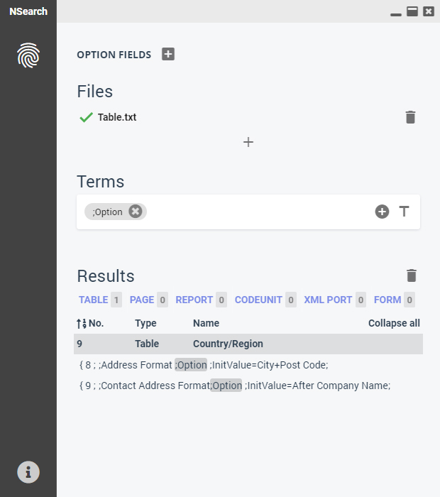
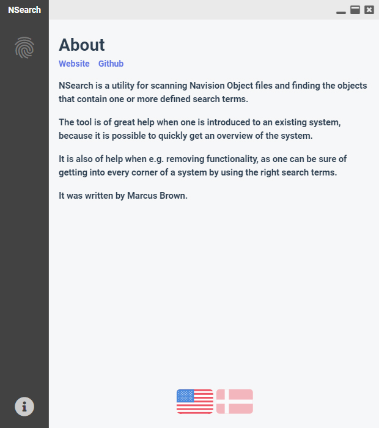

# NSearch
NSearch is a utility for scanning Navision Object files (.FOB & .AL) and finding the objects that contain one or more defined search terms.

The tool is of great help when one is introduced to an existing system, because it is possible to quickly get an overview of said system.

It is also of help when e.g. removing functionality, as one can be sure of getting into every corner of a system by using the right search terms. 

NSearch is currently maintained by Marcus Brown.

## Images

## Features
* Simple search
* Regex search

## Planned features
* Autosave tabs

## Translation 
To contribute simply create a pull request.

Supported languages:
* English
* Danish

## TODO's
TODO's are marked in the source code. Simply search for "TODO".

## Contributing
Pull requests are welcome.

For large changes, please open an issue first to discuss what you would like to add.

## Credits
